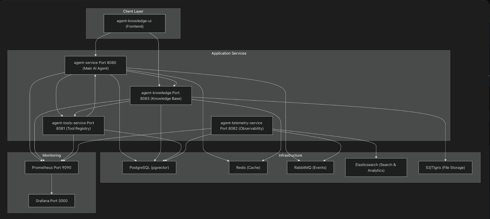

# Yuqi's AI Agent Platform

A multi-module Spring Boot platform for building AI-powered agents with RAG (Retrieval-Augmented Generation), tool invocation, knowledge management, and telemetry capabilities.

---

## Demo

https://github.com/user-attachments/assets/beecf647-26e2-4185-85ee-2d8847284b84


---

## Architecture



---

## Key Components and Connections

### Application Services

| Module | Description | Port | Technology |
|--------|-------------|------|------------|
| **agent-common** | Shared models, DTOs, and utilities | - | Java library |
| **agent-service** | Core AI agent service with RAG & streaming responses | 8080 | Spring WebFlux (Reactive) |
| **agent-knowledge** | Knowledge base management - document upload, chunking, embeddings | 8083 | Spring WebMVC |
| **agent-knowledge-ui** | React-based web UI for knowledge management | 5173 (dev) / 80 (prod) | Vite + React |
| **agent-tools-service** | MCP tool registry and execution service | 8081 | Spring WebMVC |
| **agent-telemetry-service** | Telemetry event consumer, trace persistence & replay | 8082 | Spring WebMVC |

### Infrastructure Services

| Service | Description | Port | Image |
|---------|-------------|------|-------|
| **PostgreSQL** | Primary database with pgvector extension for embeddings | 5432 | pgvector/pgvector:pg16 |
| **Redis** | Caching and session storage | 6379 | redis:7.2-alpine |
| **RabbitMQ** | Async messaging for telemetry events | 5672 / 15672 (mgmt) | rabbitmq:3-management-alpine |
| **Elasticsearch** | Telemetry indexing and search | 9200 | elasticsearch:8.13.4 |
| **Kibana** | Elasticsearch visualization | 5601 | kibana:8.13.4 |

### Monitoring Stack

| Service | Description | Port |
|---------|-------------|------|
| **Prometheus** | Metrics collection | 9090 |
| **Grafana** | Dashboards and visualization | 3000 |

### Service Connections

```
                          ┌─────────────────────────┐
                          │  agent-knowledge-ui     │
                          │       (:5173)           │
                          └───────────┬─────────────┘
                                      │
        ┌─────────────────────────────┼─────────────────────────────┐
        │                             │                             │
        ▼                             ▼                             ▼
┌───────────────┐           ┌─────────────────┐           ┌─────────────────┐
│ agent-service │──────────►│ agent-knowledge │           │agent-tools-svc  │
│    (:8080)    │◄──────────│    (:8083)      │           │    (:8081)      │
└───────┬───────┘           └────────┬────────┘           └────────┬────────┘
        │                            │                             │
        │                            │                             │
        │    ┌───────────────────────┴─────────────────────────────┘
        │    │           │                    │
        ▼    ▼           ▼                    ▼
┌────────────────┐  ┌─────────┐  ┌─────────────────┐  ┌───────────────────────┐
│   PostgreSQL   │  │  Redis  │  │    RabbitMQ     │  │agent-telemetry-service│
│  (+pgvector)   │  │         │  │                 │──│       (:8082)         │
└────────────────┘  └─────────┘  └─────────────────┘  └───────────┬───────────┘
                                                                  │
                                                                  ▼
                    ┌───────────┐  ┌───────────┐       ┌─────────────────┐
                    │ Prometheus│──│  Grafana  │       │  Elasticsearch  │
                    └───────────┘  └───────────┘       └─────────────────┘
```

---

## Prerequisites

Before running the platform, ensure you have the following installed:

| Requirement | Version | Notes |
|-------------|---------|-------|
| **Java** | 21+ | Required for all backend services |
| **Maven** | 3.9+ | Build tool |
| **Docker** | 24+ | For running infrastructure services |
| **Docker Compose** | v2+ | Container orchestration |
| **Node.js** | 18+ | For agent-knowledge-ui development |

### Optional

| Requirement | Notes |
|-------------|-------|
| **OpenAI API Key** | For GPT models and embeddings |
| **DeepSeek API Key** | Alternative LLM provider |
| **Gemini API Key** | Google AI models |
| **DashScope API Key** | Alibaba Qwen models (vision support) |
| **S3/Tigris Storage** | For document storage |

---

## Project Setup

### 1. Clone the Repository

```bash
git clone https://github.com/yuqiguo/ai-agent-platform.git
cd ai-agent-platform
```

### 2. Configure Environment Variables

```bash
# Copy the example environment file
cp .env.example .env

# Edit .env with your API keys and configuration
vim .env
```

### 3. Start Infrastructure Services

```bash
# Start PostgreSQL, Redis, RabbitMQ, Elasticsearch, and monitoring
docker-compose up -d

# Verify services are running
docker-compose ps
```

### 4. Build All Modules

```bash
# Clean build with all modules
mvn clean install

# Build skipping tests (faster)
mvn clean install -DskipTests

# Build specific module with dependencies
mvn clean install -pl agent-service -am -DskipTests
```

### 5. Run Services Locally

```bash
# Terminal 1: Run agent-service
source .env && mvn spring-boot:run -pl agent-service

# Terminal 2: Run agent-knowledge
source .env && mvn spring-boot:run -pl agent-knowledge

# Terminal 3: Run agent-tools-service
source .env && mvn spring-boot:run -pl agent-tools-service

# Terminal 4: Run agent-telemetry-service
source .env && mvn spring-boot:run -pl agent-telemetry-service

# Terminal 5: Run agent-knowledge-ui (development)
cd agent-knowledge-ui && npm install && npm run dev
```

### Run with Docker Compose (Full Stack)

```bash
# Start infrastructure + all application services
docker-compose --profile app up -d

# View logs
docker-compose logs -f agent-service

# Stop all services
docker-compose down

# Stop and remove volumes (clean start)
docker-compose down -v
```

---

## API Documentation (Swagger UI)

All services expose OpenAPI documentation via Swagger UI:

| Service | Swagger UI | OpenAPI JSON |
|---------|------------|--------------|
| agent-service | http://localhost:8080/swagger-ui.html | http://localhost:8080/v3/api-docs |
| agent-knowledge | http://localhost:8083/swagger-ui.html | http://localhost:8083/v3/api-docs |
| agent-tools-service | http://localhost:8081/swagger-ui.html | http://localhost:8081/v3/api-docs |
| agent-telemetry-service | http://localhost:8082/swagger-ui.html | http://localhost:8082/v3/api-docs |

### Key Endpoints

#### agent-service (:8080)

| Method | Endpoint | Description |
|--------|----------|-------------|
| POST | `/answer/stream` | SSE streaming answer with RAG |
| POST | `/kb/search` | Search knowledge base |
| GET | `/kb/documents/{id}` | Get document by ID |
| GET | `/actuator/health` | Health check |

#### agent-knowledge (:8083)

| Method | Endpoint | Description |
|--------|----------|-------------|
| GET | `/documents` | List all documents |
| GET | `/documents/search` | Search documents |
| POST | `/upload` | Upload document (multipart) |
| POST | `/upload/text` | Upload text content |
| POST | `/upload/presign` | Get presigned upload URL |
| POST | `/search/fuzzy` | Fuzzy search documents |

#### agent-tools-service (:8081)

| Method | Endpoint | Description |
|--------|----------|-------------|
| POST | `/mcp/list_tools` | List available MCP tools |
| POST | `/mcp/call_tool` | Invoke an MCP tool |

#### agent-telemetry-service (:8082)

| Method | Endpoint | Description |
|--------|----------|-------------|
| GET | `/api/runs` | List all agent runs |
| GET | `/api/runs/{runId}` | Get run details |
| GET | `/api/runs/{runId}/tools` | Get tool invocations for a run |
| POST | `/api/runs/{runId}/replay` | Replay a run |
| GET | `/api/runs/{runId}/children` | Get child runs |
| GET | `/api/dlq` | List dead letter queue items |
| POST | `/api/dlq/{id}/requeue` | Requeue failed message |
| GET | `/api/dlq/stats` | DLQ statistics |

---

## Environment Variables

Copy `.env.example` to `.env` and configure your settings:

```bash
cp .env.example .env
```

**Required for AI features:**
- `OPENAI_API_KEY` or `DEEPSEEK_API_KEY` - LLM provider
- `DASHSCOPE_API_KEY` - Vision model (document processing)

**Infrastructure (auto-configured in Docker Compose):**
- `DB_URL`, `REDIS_URL`, `RABBITMQ_URL`, `ELASTIC_BASE_URL`

See [.env.example](.env.example) for all available options.

---

## Tech Stack

### Backend

- **Java 21** + **Spring Boot 3.5.x**
- **Spring AI 1.1.2** - AI/LLM integration
- **Spring WebFlux** - Reactive streaming (agent-service)
- **Spring WebMVC** - REST APIs (other services)
- **Spring Data JPA** - Database access
- **Lombok** - Boilerplate reduction
- **SpringDoc OpenAPI 2.3** - API documentation

### Frontend

- **React 18** + **Vite**
- **Axios** - HTTP client
- **Firebase** - Authentication (optional)

### Data Storage

- **PostgreSQL 16** with **pgvector** - Primary DB + vector embeddings
- **Redis 7.2** - Caching
- **Elasticsearch 8.13** - Full-text search & telemetry

### Messaging

- **RabbitMQ 3** - Async event messaging

### Monitoring

- **Prometheus** - Metrics collection
- **Grafana** - Visualization dashboards
- **Spring Boot Actuator** - Health checks & metrics

---

## Testing

```bash
# Run all tests
mvn test

# Run tests for specific module
mvn test -pl agent-service

# Run tests with coverage report
mvn test jacoco:report

# Integration tests only
mvn verify -Pintegration-tests
```

---

## Telemetry Events

The platform emits the following telemetry events via RabbitMQ:

| Event Type | Description |
|------------|-------------|
| `run.start` | Agent run started |
| `run.rag_done` | RAG retrieval completed |
| `run.tool_call` | Tool invocation started |
| `run.tool_result` | Tool invocation completed |
| `run.final` | Final answer generated |
| `run.failed` | Run failed with error |
| `run.cancelled` | Run cancelled |

---

## Management UIs

| Service | URL | Credentials |
|---------|-----|-------------|
| RabbitMQ Management | http://localhost:15672 | aiagent / aiagent_pwd |
| Kibana | http://localhost:5601 | - |
| Grafana | http://localhost:3000 | admin / admin |
| Prometheus | http://localhost:9090 | - |

---

## Development

### Code Style

The project follows standard Java code conventions with Lombok for reducing boilerplate.

### Module Dependencies

```
agent-common (shared library)
    ↑
    ├── agent-service
    ├── agent-knowledge
    ├── agent-tools-service
    └── agent-telemetry-service
```

### Hot Reload (Development)

```bash
# Enable Spring Boot DevTools hot reload
mvn spring-boot:run -Dspring-boot.run.jvmArguments="-Dspring.devtools.restart.enabled=true"
```

---

## Production Deployment

For production deployment, use the production compose file:

```bash
# Build production Docker images
docker-compose -f docker-compose.prod.yml build

# Start production stack
docker-compose -f docker-compose.prod.yml up -d
```

---

## License

MIT
